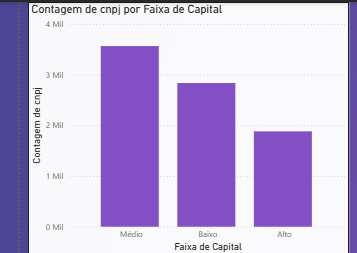
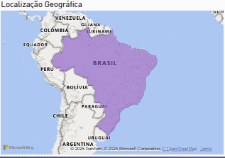
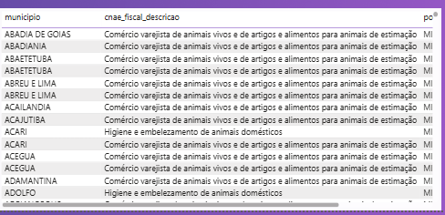
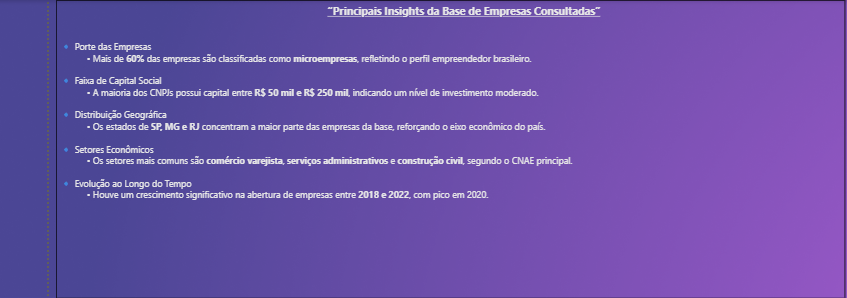

# 🚀 Consulta de CNPJs via API Pública + Dashboard Power BI

Este projeto realiza a extração de dados públicos de empresas brasileiras a partir de uma lista de CNPJs, utilizando a API gratuita do projeto [Minha Receita](https://minhareceita.org/). Os dados coletados são estruturados em um arquivo CSV e visualizados em um dashboard interativo no Power BI.

  

---

## 📌 Objetivos

- Automatizar a coleta de dados empresariais via API pública  
- Estruturar os dados para análise e visualização  
- Criar um dashboard interativo para explorar insights sobre empresas brasileiras  
- Demonstrar habilidades em Python, manipulação de dados e Business Intelligence  

---

## 🛠️ Tecnologias Utilizadas

- 🐍 **Python** (pandas, requests)  
- 📓 **Jupyter Notebook**  
- 🌐 **API Minha Receita**  
- 📊 **Power BI**  
- 🧬 **Git & GitHub**  

---

## 📁 Estrutura do Projeto

📄 **PET.xlsx**  
Arquivo original contendo a lista de CNPJs a serem consultados.

📓 **raspagem_cnpj_api_minha_receita.ipynb**  
Notebook Jupyter com o código Python para consulta à API e exportação dos dados.

📊 **resultado_cnpjs.csv**  
Arquivo gerado com os dados estruturados, pronto para uso no Power BI.

🖼️ **imagens/**  
Pasta com capturas de tela do dashboard criado no Power BI.

📝 **README.md**  
Documentação do projeto com objetivos, tecnologias e instruções de uso.

---

## 📊 Dashboard Power BI

O dashboard criado permite explorar os seguintes aspectos:

- 🗺️ Distribuição de empresas por estado (UF)  
- 🏢 Classificação por porte (micro, pequena, média, grande)  
- 📈 Evolução de abertura de empresas ao longo dos anos  
- 🔍 Tabela interativa com filtros por município, CNAE e capital social  
- 💰 Relação entre capital social e tempo de atividade  

> 📷 *Veja abaixo algumas capturas do dashboard:*  

 

---

## 🧠 Habilidades Demonstradas

- 🔗 Consumo de APIs REST  
- 🧹 Manipulação de dados com pandas  
- ⚙️ Automação de processos com Python  
- 🧱 Preparação de dados para BI  
- 📊 Criação de visualizações interativas  
- 📦 Organização de projeto para portfólio  

---

## 💼 Para Recrutadores

Este projeto mostra minha capacidade de transformar dados públicos em insights relevantes, utilizando ferramentas acessíveis e boas práticas de análise. É um exemplo real de como aplico Python e Power BI para resolver problemas e comunicar resultados.

---

## 📥 Como Usar

1. 🔄 Clone este repositório  
2. ▶️ Execute o notebook `raspagem_cnpj_api_minha_receita.ipynb`  
3. 📁 Gere o arquivo `resultado_cnpjs.csv`  
4. 📊 Importe o CSV no Power BI Desktop  
5. 🧭 Explore e personalize o dashboard  

---

## 📬 Contato

**👤 Nome:** Igor Carvalho
**📍 Localização:** Guarujá, SP  
**🔗 LinkedIn:** [https://www.linkedin.com/in/igor-carvalho-9952141a8/]
